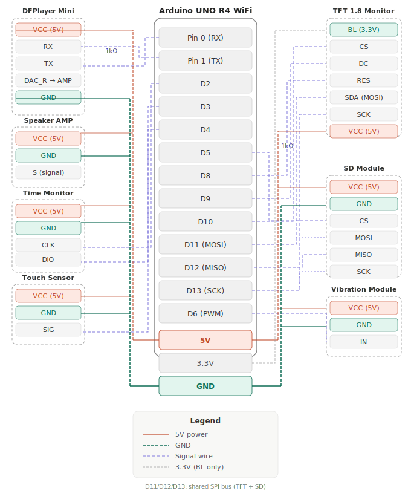

# 🐾 White Cat Alarm Clock

A Wi-Fi connected smart alarm clock built on the **Arduino UNO R4 WiFi**, featuring an animated TFT cat display, weather-aware reactions, touch controls, and a mobile-friendly web interface for setting the alarm.

---

## ✨ Features

| Feature | Description |
|---|---|
| 🕐 Real-time clock | NTP-synced RTC displayed on a TM1637 4-digit segment display |
| 😺 Animated cat | ST7735 TFT shows an idle cat that randomly blinks |
| 🌤️ Weather reactions | After alarm dismissal, displays a weather icon based on the day's forecast |
| 🔔 Alarm | Plays audio via DFPlayer Mini + vibration motor |
| 👆 Touch controls | Short press → greeting; Long press → reaction; Any press → dismiss alarm |
| 🌐 Web interface | Set alarm time from any device on the same Wi-Fi network |
| 📡 Non-blocking | Entire firmware is interrupt-free and delay-free |

---

## 🗂️ Project Structure

```
white-cat-alarm/
├── arduino/
│   └── white_cat_alarm/
│       ├── white_cat_alarm.ino   # Main firmware
│       └── config.h              # ← Edit this before uploading
├── google-apps-script/
│   └── weather_endpoint.gs       # Google Apps Script weather proxy
├── docs/
│   └── images/                   # Wiring diagrams, screenshots
├── .gitignore
└── README.md
```

---

## 🔧 Hardware Requirements

| Component | Notes |
|---|---|
| Arduino UNO R4 WiFi | Main microcontroller |
| TM1637 4-digit display | Shows HH:MM with blinking colon |
| ST7735 TFT (128×160) | Displays cat animations and weather icons |
| DFPlayer Mini | MP3 playback via Serial1 |
| Micro SD card (×2) | One for TFT BMP images, one for DFPlayer audio |
| Capacitive touch sensor | TTP223 or similar, active HIGH |
| Vibration motor module | PWM-controlled via MOTOR_PIN |

---

## 📌 Wiring



| Arduino Pin | Connected To |
|---|---|
| D2 (CLK) | TM1637 CLK |
| D3 (DIO) | TM1637 DIO |
| D4 | Touch sensor signal |
| D5 (SD_CS) | SD card CS (for TFT BMP images) |
| D6 (PWM) | Vibration motor |
| D8 | TFT RST |
| D9 | TFT DC |
| D10 | TFT CS |
| D11 (MOSI) | TFT SDA / SD MOSI (shared SPI bus) |
| D13 (SCK) | TFT SCK / SD SCK (shared SPI bus) |
| TX1 / RX1 | DFPlayer TX / RX |

> **Note:** TFT and SD card share the SPI bus. CS pins are managed in firmware to avoid conflicts. The DFPlayer uses the hardware Serial1 port.

> **Note:** Pin 1 needs a 1kΩ resistor, all pins on TFT need a 1kΩ resistor connected to the main Arduino board, but SD module doesn't need. 

---

## 🖼️ SD Card — BMP Images

Place these 24-bit BMP files (128×160 px) in the **root** of the SD card attached to the TFT module:

| File | Description |
|---|---|
| `01.bmp` | Cat — eyes open (idle) |
| `02.bmp` | Cat — eyes closed (blink) |
| `03.bmp` | Short press reaction |
| `04.bmp` | Long press reaction |
| `05.bmp` | Alarm dismissed reaction |
| `06.bmp` | Weather: Rainy (PoP > 50 %) |
| `07.bmp` | Weather: Cold (min < 15 °C) |
| `08.bmp` | Weather: Hot (max > 25 °C) |
| `09.bmp` | Weather: Windy (wind level > 3) |
| `10.bmp` | Weather: Clear / default |

---

## 🎵 DFPlayer Audio Files

Place these MP3 files on the SD card inside the DFPlayer module:

| File | Played On |
|---|---|
| `001.mp3` | Short press / alarm loop |
| `002.mp3` | Long press |

---

## 🚀 Setup Instructions

### 1. Clone the repository

```bash
git clone https://github.com/YOUR_USERNAME/white-cat-alarm.git
cd white-cat-alarm
```

### 2. Deploy the weather endpoint

1. Go to [script.google.com](https://script.google.com) and create a new project.
2. Paste the contents of `google-apps-script/weather_endpoint.gs`.
3. Set `API_KEY` to your [CWA Open Data](https://opendata.cwa.gov.tw) API key.
4. Set `LOCATION_NAME` to your city (URL-encoded). See the comment block in the file for examples.
5. Click **Deploy → New deployment → Web app**.
   - Execute as: **Me**
   - Who has access: **Anyone**
6. Copy the deployment URL — you will need the path in the next step.

### 3. Configure the Arduino sketch

Open `arduino/white_cat_alarm/config.h` and fill in:

```cpp
#define WIFI_SSID     "your_network_name"
#define WIFI_PASSWORD "your_password"
#define WEATHER_PATH  "/macros/s/YOUR_DEPLOYMENT_ID/exec"
```

Adjust `NTP_OFFSET` if you are outside UTC+8.

### 4. Install Arduino libraries

Install the following via **Tools → Manage Libraries**:

- `TM1637Display` by Avishay Orpaz
- `NTPClient` by Fabrice Weinberg
- `DFRobotDFPlayerMini` by DFRobot
- `Adafruit ST7735 and ST7789 Library` by Adafruit
- `Adafruit GFX Library` by Adafruit
- `SD` (built-in)

The `RTC` and `WiFiS3` libraries are bundled with the **Arduino UNO R4 WiFi** board package.

### 5. Upload

Select **Board: Arduino UNO R4 WiFi**, choose the correct port, and click Upload.

Open the Serial Monitor at **115200 baud** to verify:
- Wi-Fi connection and IP address
- NTP sync
- DFPlayer initialization
- Weather fetch

### 6. Set the alarm

Open a browser and navigate to the IP address shown in the Serial Monitor (e.g. `http://192.168.1.42`). Use the time picker to set your alarm and tap **Set Alarm**.

---

## 🌤️ Weather Logic

The Google Apps Script fetches data from the CWA `F-C0032-001` dataset (36-hour city forecast) and returns a single CSV line. The Arduino parses this and selects a weather icon using the following priority:

1. **Rainy** — if precipitation probability > 50 %
2. **Cold** — if minimum temperature < 15 °C
3. **Hot** — if maximum temperature > 25 °C
4. **Windy** — if wind level > 3
5. **Clear** — default fallback

The weather icon is shown 3 seconds after the alarm is dismissed.

---

## 📱 Web Interface

The built-in web server (port 80) serves a mobile-friendly page at the device IP:

- **Time picker** — select alarm time
- **Current alarm** — shows the active alarm setting
- **Weather summary** — temperature range, precipitation %, description, wind level
- **Device time** — current RTC time

---

## 🤝 Contributing

Pull requests are welcome. Please open an issue first to discuss any major changes.

---

## 📄 License

[MIT](LICENSE)
